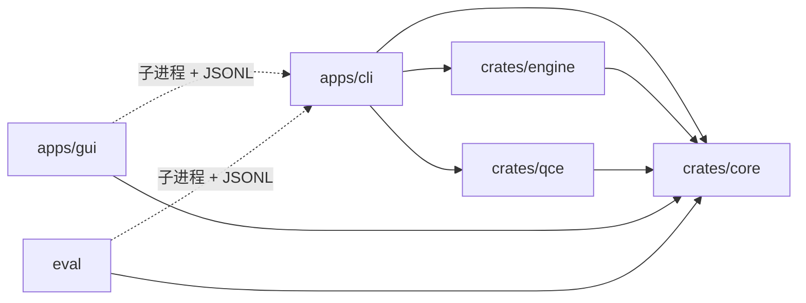
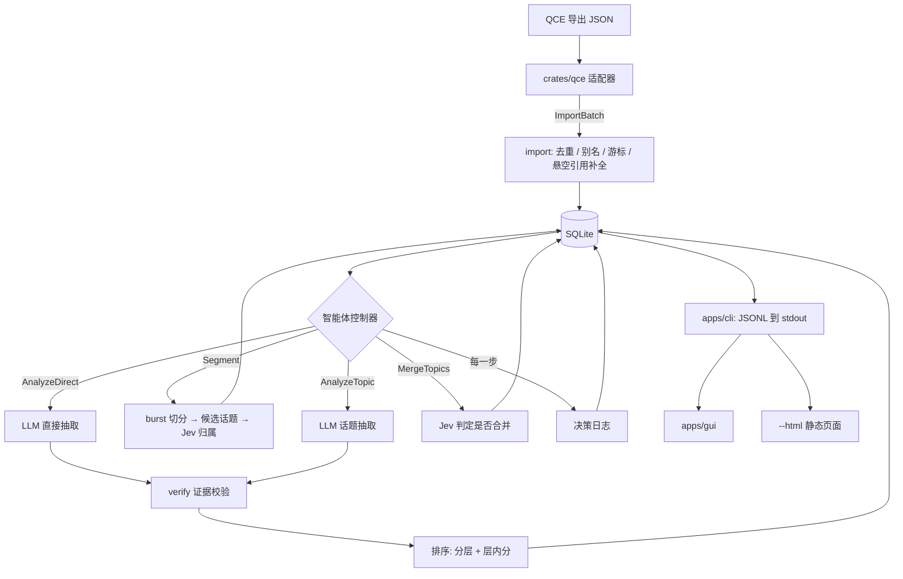

# 架构（ARCHITECTURE）

> 用途：说明系统由哪些模块组成、数据怎么流动、谁负责什么，以及哪些设计不变量不能破坏。
> 读者：全体成员。动手前先读这一份，再读自己负责模块的专项文档。

## 1. 立意

chat-tldr 与“把聊天记录直接丢给通用 LLM 总结”的区别，决定了下面每一个模块的存在理由：

| 立意 | 落在哪里 |
|---|---|
| **持续维护状态**：只分析上次之后的新消息 | 幂等导入 + 三个游标 + 在线话题聚类 + 结论可以更新（PIPELINE §1、§3） |
| **面向个人**：优先展示 @我、分配给我的任务、截止日期 | 规则判定 @我 + P0–P3 分层（PIPELINE §6.1、§7） |
| **可追溯**：每条结论附带原始消息证据，由程序校验 | Evidence + `verify` 模块 + 渲染视图（PIPELINE §2.2、§6.2） |
| **个性化**：根据反馈调整排序，但不降级硬优先级 | 有界的在线偏好校准（PIPELINE §7.3） |
| **智能体**：有界控制器根据状态选择下一步 | AgentAction + 决策日志（PIPELINE §8） |

## 2. 仓库结构

Cargo workspace：

| 路径 | crate 名 | 类型 | 负责人 | 职责 |
|---|---|---|---|---|
| `crates/core` | `chat-tldr-core` | lib | @Develata | 共享类型（冻结）：UnifiedMessage、Insight、CliEvent、AgentAction 及其子类型；`ImportBatch` |
| `crates/qce` | `chat-tldr-qce` | lib | 同学 A | QCE JSON → `ImportBatch`（UnifiedMessage 列表 + 会话元数据） |
| `crates/engine` | `chat-tldr-engine` | lib | @Develata | 存储、渲染、切分、Decider/LLM/Embedder、抽取、校验、排序、控制器 |
| `crates/engine/src/temporal` | （engine 的模块） | | 同学 A | 截止日期规范化（纯函数） |
| `crates/engine/src/verify` | （engine 的模块） | | 同学 A | 证据校验（纯函数） |
| `apps/cli` | `chat-tldr`（二进制） | bin | @Develata | 命令解析、JSONL 输出、`--html` 渲染 |
| `apps/gui` | `chat-tldr-gui` | bin | 同学 B | egui/eframe 面板，通过子进程调用 CLI |
| `eval/` | `chat-tldr-eval` | bin | 同学 C | 标注数据、指标计算、实验脚本、演示数据 |
| `fixtures/` | — | 数据 | @Develata 建立，各自补充 | 合成的 QCE 导出样例、mock JSONL、mock 模型响应 |
| `docs/` | — | 文档 | @Develata | 本文档集 |

依赖方向（箭头表示“依赖于”）：



- **GUI 和 eval 只依赖 `core`**，不能依赖 `engine` 或 `qce`。它们通过运行 `chat-tldr` 子进程拿数据。
- `qce` 不依赖 `engine`，`engine` 也不依赖 `qce`：两者只通过 `core::ImportBatch` 连接，由 CLI 负责组装。

## 3. 数据流



## 4. 模块边界

### 4.1 `crates/qce`（对外接口，冻结给同学 A）

```rust
pub fn parse_qce_json(bytes: &[u8], opts: &QceOptions) -> Result<ImportBatch, QceError>;

pub struct QceOptions { pub timezone: FixedOffset, pub max_forward_depth: u8 /* = 2 */ }

// 以下类型定义在 crates/core
pub struct ImportBatch {
    pub chat: ChatMeta,
    pub messages: Vec<UnifiedMessage>,     // 按 (sent_at, 文件内顺序) 排序
    pub aliases: Vec<AliasObservation>,    // (PersonId, 别名, 别名类型)，供 person_aliases 表
    pub warnings: Vec<String>,             // 未知元素类型等，CLI 转成 W_UNKNOWN_ELEMENT
    pub file_hash: String,                 // "blake3:<hex>"
}
pub struct ChatMeta {
    pub chat_id: ChatId, pub kind: ChatKind, pub display_name: String,
    pub self_uid: Option<String>, pub self_uin: Option<String>,
}
```

qce 不做 IO（不读文件、不访问数据库），这样测试只需要喂字节。

### 4.2 `crates/engine`

内部模块（非冻结，由 @Develata 维护）：

| 模块 | 职责 |
|---|---|
| `store` | SQLite 连接、迁移、事务、全部读写（唯一访问数据库的地方） |
| `render` | `render(msg, profile)` |
| `segment` | burst、候选话题、归属、关闭、合并候选 |
| `decider` | `Decider` trait、`JevDecider`、`LlmDecider`、`MockDecider` |
| `llm` | `LlmClient` trait、OpenAI 兼容与 Anthropic 兼容两种实现、Mock |
| `embed` | `Embedder` trait、`OpenAiCompatEmbedder`、`TfIdfEmbedder`、Mock |
| `extract` | 话题抽取提示词、输出 schema、MentionMe 生成 |
| `temporal` | 截止日期规范化（同学 A） |
| `verify` | 证据校验（同学 A） |
| `rank` | 分层、先验分、偏好权重 |
| `agent` | 观测、规则、Jev 选择、执行、检查点 |
| `cache` | 缓存键、读写、用量统计 |
| `baseline` | B0、B1、sim-* 基线策略 |

### 4.3 `apps/cli`

只负责参数解析、调用 engine、把结果编码成 CliEvent 输出到 stdout，以及 `--html`（minijinja 模板）。不包含业务逻辑。

### 4.4 `apps/gui`

- 后台线程运行 `chat-tldr` 子进程，逐行读取 stdout，反序列化成 `core::CliEvent`，通过 `std::sync::mpsc` channel 发给 UI 线程。
- UI 线程每帧 `try_recv` 直到队列为空，收到新事件后调用 `ctx.request_repaint()`。**UI 线程绝不阻塞**。
- 启动时先运行 `chat-tldr version` 检查协议 MAJOR 版本。
- 中文字体打包进程序（`FontDefinitions`），否则中文会显示成方块。

## 5. 设计不变量

违反下列任何一条都是 bug，review 时会被直接拒绝。

| # | 不变量 | 怎么保证 |
|---|---|---|
| I1 | **证据可追溯**：进入收件箱的每条结论都有证据；高风险结论的每条证据都通过校验 | `verify` 模块 + `rejected` 不进收件箱 + 测试 |
| I2 | **LLM 提出，Rust 验证**：模型输出的 message 引用、quote、截止日期原文都要经过程序校验，不能直接相信 | Verify 是控制器的强制步骤（规则 R1） |
| I3 | **幂等导入**：同一文件导入多次，或两次导出有重叠，数据库内容不变 | `MessageId` 由 `(chat_id, source_identity)` 确定性生成 + 唯一约束 + 测试 |
| I4 | **身份不用昵称**：发送者身份只用 `sender.uid`，昵称和群名片只是可变属性 | `PersonId = qq:<uid>`；别名单独存表 |
| I5 | **@我 只由规则判定** | PIPELINE §6.1；任何模型都不参与 |
| I6 | **反馈不降级 P0**：层级只由规则决定，反馈只调整层内排序，幅度 ≤ 0.5 | `rank` 模块 + 测试 |
| I7 | **GUI 不碰数据库**：GUI 永远不直接读写 SQLite | GUI 只依赖 `core`（Cargo 依赖层面就做不到） |
| I8 | **stdout / stderr 分离**：stdout 只有 JSONL，stderr 只有日志 | CLI 里只有一个 stdout writer；日志统一走 `tracing` 到 stderr；集成测试逐行解析 stdout |
| I9 | **测试不调用真实服务**：CI 不需要任何密钥 | 所有模型通过 trait 注入，测试只用 Mock |
| I10 | **有界控制器**：有最大步数、预算和可证明的终止性，每一步都写入决策日志 | PIPELINE §8.3 |
| I11 | **last_reviewed 只由用户推进** | 只有 `mark-read` 修改它，且 `--up-to` 必须来自 GUI 显示过的 `view_cursor` |

## 6. 技术栈

| 用途 | 选择 | 备注 |
|---|---|---|
| 语言 | Rust stable，edition 2024 | 全栈 Rust，见 ADR-0002 |
| 序列化 | `serde`、`serde_json` | |
| 时间 | `chrono`（启用 `serde`） | |
| 哈希 | `blake3` | ID、缓存键、文件哈希 |
| 数据库 | `rusqlite`（启用 `bundled`） | WAL、busy_timeout、事务 |
| HTTP | `reqwest`（`blocking`、`json`、`rustls-tls`） | Jev、LLM、Embedding 共用，不使用 async，见 ADR-0008 |
| JSON Schema | `schemars` | 生成写进提示词的输出 schema |
| 分词 | `jieba-rs` | 仅 TF-IDF 基线使用 |
| CLI | `clap`（derive）、`minijinja`、`tracing` + `tracing-subscriber` | |
| 错误 | lib 用 `thiserror`，bin 用 `anyhow` | |
| GUI | `eframe` / `egui`（从 eframe_template 起步） | 打包一个 OFL 许可的中文字体，见 OPEN_QUESTIONS Q-GUI-1 |
| 评估 | `chat-tldr-eval`（Rust），输出 CSV；校准曲线用 `plotters` 出 PNG | |

具体版本号在第 1 天建骨架时由 @Develata 锁定到 `Cargo.lock`。

## 7. 与 QCE 的关系

- 只读取 QCE 导出的 JSON 文件，**不链接、不复制 QCE 的任何代码**（QCE 是 GPL-3.0，本项目是 MIT），见 ADR-0001。
- 字段结构的依据：QCE 仓库 commit `7fcca88`（2026-09-11）的 `qq-chat-export-core/src/types.rs`、`json_exporter.rs`、`json_templates.rs`，以及 `qq-chat-export-server/src/parser/simple_parser.rs`。只参考了字段名和结构，没有复制代码。
- 单文件 JSON 的顶层结构：`metadata`、`chatInfo`、`statistics`、`messages[]`，可选 `avatars`、`exportOptions`。
- 未确认的字段在 [OPEN_QUESTIONS.md](OPEN_QUESTIONS.md) 中以 Q-QCE-* 编号列出。

## 8. 相关文档

- 类型与表结构：[DATA_MODEL.md](DATA_MODEL.md)
- 命令与事件：[CLI_PROTOCOL.md](CLI_PROTOCOL.md)
- 算法与规则：[PIPELINE.md](PIPELINE.md)
- 评估：[EVALUATION.md](EVALUATION.md)
- 计划与分工：[ROADMAP.md](ROADMAP.md)
- 设计决策：[decisions/](decisions/)
- 待定问题：[OPEN_QUESTIONS.md](OPEN_QUESTIONS.md)
