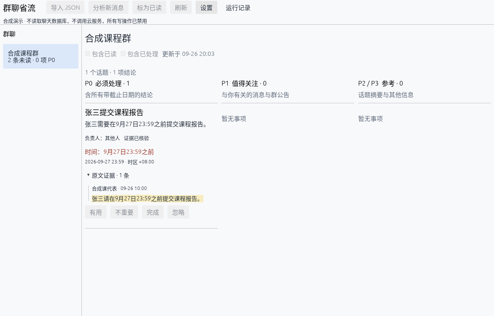
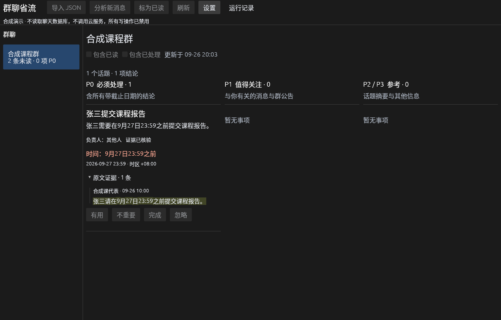
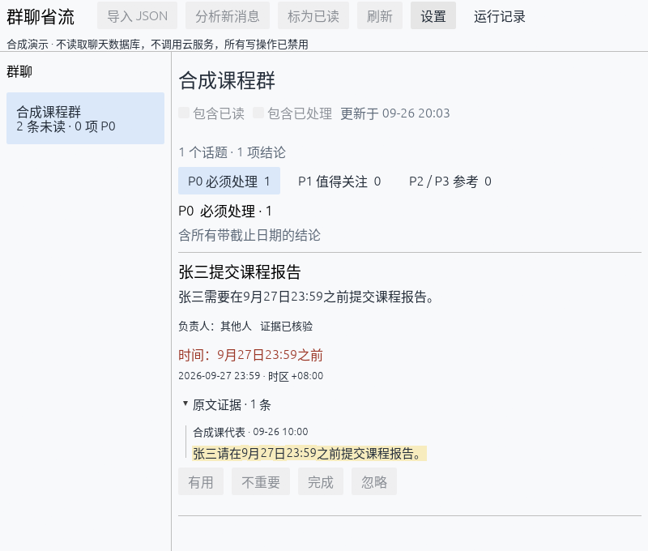
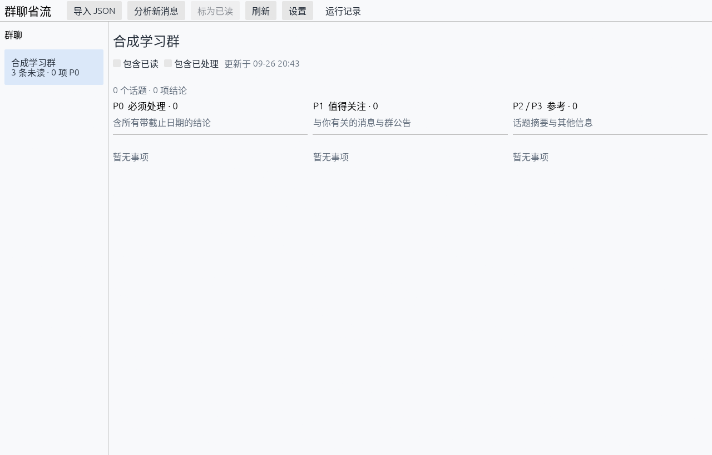

# GUI 本地验证（2026-09-26）

本轮在 Windows 上运行真实 eframe 窗口，并从窗口自身帧缓冲导出截图，不截取桌面其他内容。所有画面均来自仓库合成 fixtures；没有读取用户导出、容器令牌或调用云服务。

| 检查 | 结果与范围 |
|---|---|
| workspace 回归 | 219 项测试通过；fmt、严格 clippy 通过 |
| GUI 定向回归 | 18 项，含 4 项真实 egui 指针 press/release 交互；设置、深色切换、日志、窄屏标签、筛选和禁用状态通过 |
| CLI 子进程传输 | 临时 helper 真实进程：stdout/stderr 并发、日志洪泛、坏协议主动终止、退出码不符、取消不伪造 130 |
| 已读边界 | 成功完整快照且已展示后才能回传 cursor；中断/失败/过期请求和切群不能授权旧 cursor；写操作后 Chats→Inbox 更新摘要 |
| 原生画面 | 浅色/深色 1280×820、窄窗口 800×680；中文、时间和负责人、证据高亮、三栏/标签切换正常 |
| 真实 CLI 本地联调 | 将 synthetic-group.json 的 3 条消息导入独立 SQLite 后，GUI 自动握手、列群、读取收件箱；尚未分析时收件箱为空，不能标为已读 |
| 隔离与性能边界 | GUI 只依赖 core，不访问 SQLite/engine；后台进程与文件 I/O，64 槽传输队列，每帧最多处理 128 条事件，每栏每页 20 项，按快照缓存分栏索引 |

没有测量墙钟提速比例。原生截图证明本机渲染，不代替真实云质量、操作系统级所有输入方式、系统文件选择器或 Linux/macOS 验收。指针测试由 egui RawInput 注入，不声称自动操作过 Windows 文件选择器。GUI “停止”采用进程终止，不等同于 Windows 控制台 Ctrl-C，后者仍待实测。

复现合成演示：

```powershell
cargo build --workspace --locked
.\target\debug\chat-tldr-gui.exe --demo
.\target\debug\chat-tldr-gui.exe --demo --dark
cargo test -p chat-tldr-gui --locked
```

开发截图可额外传 `--screenshot <绝对PNG路径> --quit-after-capture`；仅在 CLI 完成、窗口稳定后采集。`--width 800 --height 680` 可复现窄窗口。截图输出必须留在你选择的目录，真实聊天截图不得提交。

## 浅色合成收件箱



## 深色合成收件箱



## 窄窗口



## 已导入、尚未分析的正常模式


