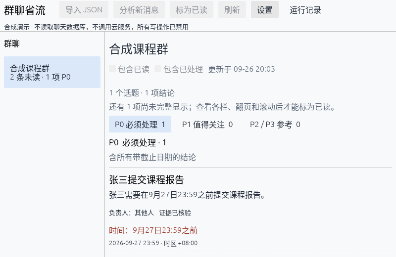

# 实现审查与修复（2026-09-26）

审查基线为 `2862ae8`，范围包括分析引擎、CLI 输出、GUI、QCE 导入、eval 及 CI。保留 core 1.0、SQLite 归属、首次云端提示和现有命令契约。回归使用合成数据、临时目录、Mock 或 localhost helper，不读取真实导出，不调用付费模型。

## 已修复问题

| 严重度 | 触发与影响 | 修复与回归证据 |
|---|---|---|
| P1 | `inbox --html <data-dir>/chat-tldr.db` 原先成功覆盖数据库；原始 JSON、配置也可能被替换 | CLI 检查业务保留路径、别名、文件类型及数据前缀；analyze 在请求模型前检查。覆盖尝试失败且原字节保留 |
| P1 | GUI 渲染第一页便允许标记整个快照已读，包括未打开标签、未翻页及裁切的结论 | 按快照记录每条结论的实际显示范围，全部显示后才授权 cursor；刷新失败撤销旧授权。egui 标签、分页、滚动裁切回归 |
| P1 | 待确认云提示未绑定群聊，切群后确认可能分析另一群；连接改变后沿用旧提示状态 | 绑定本次目标并在切群/设置改变时取消；CLI、配置或数据目录改变后重置首次提示，含启动参数覆盖回归 |
| P1 | 关闭 GUI 后后台 CLI 仍可能请求模型 | 退出时取消、终止并回收直接子进程；断开满队列再等待工作线程。真实 helper 的监听端口在析构返回前释放 |
| P1 | 不合规模型响应先写缓存，后续分析反复读取坏缓存，无法恢复 | JSON/引用校验通过才缓存；读取旧缓存时重验、淘汰无效值并重新请求。失败响应仍记已报告用量；新坏响应和旧坏缓存均有回归 |
| P1 | Jev 预算预检写死单价，配置更高价格时仍放行请求 | 使用配置单价；高单价/低预算测试确认未发出请求 |
| P2 | HTML 初次目标不存在，分析或渲染期间出现普通文件，复检反而允许覆盖 | 保留首次检查状态并贯穿 analyze 到发布；新目标始终不覆盖发布。Mock 在分析请求中创建竞争报告，文件保留且已提交业务结果可查询 |
| P2 | 检查点已提交，随后 stdout 断开，RunStats 漏记部分结论 | 提交后先完整计数再发送事件；BrokenPipe 回归核对保存的历史统计 |
| P2 | GUI 切换数据目录失败可能留下循环指针；退出丢失排队的偏好写入 | 目标偏好先落盘再更新启动指针；退出等待写入队列完成，文件选择器独立运行。失败切换、往返切换与退出保存回归 |
| P2 | GUI 等待直接子进程退出后仍无界等待管道 EOF，包装程序的后代持有管道会阻止关闭 | 取消时在直接子进程已回收后停止等待未结束的读取线程；正常流仍读完校验。真实 wrapper/helper 复现并验证退出与旧请求隔离；后代由包装程序管理 |
| P2 | eval 检查目标不存在后，普通目录 rename 仍能覆盖另一程序刚建立的空目录 | Windows 使用不替换目标的发布；Linux/macOS 使用 NOREPLACE。回归在预检后创建竞争目录，断言目标及暂存源均保留 |
| P2 | eval 导出标注拒绝协议允许的 MINOR 未知事件 | 忽略未知事件但仍验证版本、序号、run_id 与结束状态；序号断裂仍拒绝 |
| P2 | QCE 时间戳在 UTC 有效，加导入时区后却超出本地日期范围 | 普通及转发消息均检查偏移后范围；最大/最小时间与正负偏移回归，UTC 边界仍可导入 |

## 验证范围

本轮 Windows 本地验证：

- `cargo fmt --all -- --check`、`cargo clippy --workspace --all-targets --locked -- -D warnings`、`cargo build --workspace --locked` 通过。
- `cargo test --workspace --locked`：245 项通过（CLI 31、core 7、engine 139、eval 19、GUI 31、QCE 18）。测试日志保存在忽略目录 `tmp/review-workspace-tests.log`。
- `actionlint`、CI 六模块覆盖规划、`git diff --check` 通过；CodeGraph 本地索引已同步。
- 原生窗口浅色 800×680、深色 1280×820 和裁切场景 800×520 正常渲染并退出；裁切时显示未完整查看提示。这里只验证合成演示，交互语义由上述 egui/模型回归覆盖。
- 截图检查另修复 demo 组合不同时间点 fixtures 造成的侧栏 P0 数不一致，仅对齐合成快照摘要；随后 GUI 31 项定向回归、clippy、fmt 和重新构建通过。

CI 保留 Windows 六模块并发和 `fmt`、`clippy`、`test` 必需检查，新增 Linux CLI/eval 定向检查，两个汇总都要求该 job 成功。远程状态以 PR 当前提交的运行结果为准。

原生 GUI 初次截图和本地 CLI 联调见 [GUI_VERIFICATION](GUI_VERIFICATION.md)。真实 QCE 容器导出、云模型质量、操作系统文件选择器、Windows 控制台 Ctrl-C、Linux/macOS GUI 和 macOS gold 发布仍需相应环境验收。不将 Mock、源码检查或编译等同于这些验证。

## 修复后合成画面

800×520：结论被裁切时，提示仍有内容未完整查看。

800×680：[完整窄窗口](verification/gui/review-narrow.png)。1280×820：[深色三栏](verification/gui/review-wide.png)。演示模式禁用所有业务写操作；已读按钮的实际启用条件由非 demo 的交互回归验证。
